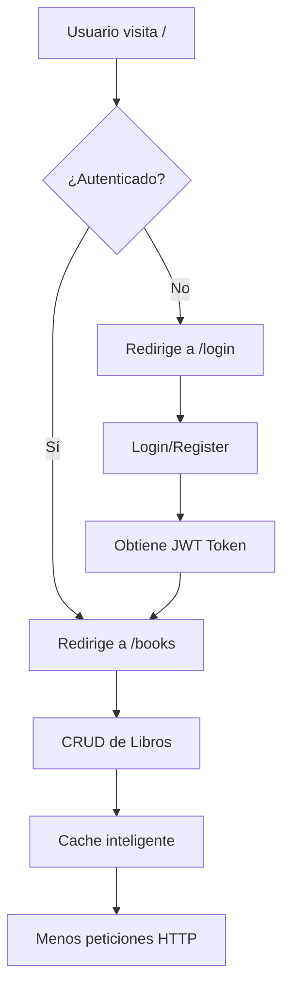

# ✨ Frontend Next.js - CRUD Flask

## 📋 Resumen

Se ha creado exitosamente un **frontend completo en Next.js 14** con las siguientes características:

### ✅ Características Implementadas

#### 🎨 **Interfaz de Usuario**
- Diseño moderno y responsivo con **Tailwind CSS**
- Modo oscuro automático según preferencias del sistema
- Animaciones y transiciones suaves
- Componentes reutilizables y limpios

#### 🔐 **Autenticación**
- Sistema completo de registro e inicio de sesión
- Manejo de JWT tokens con **localStorage**
- Redirección automática según estado de autenticación
- Auto-login después del registro
- Logout y limpieza de sesión

#### 📚 **Gestión de Libros (CRUD Completo)**
- **Crear** libros con formulario validado
- **Leer** lista de todos los libros
- **Actualizar** libros existentes
- **Eliminar** libros con confirmación
- Vista en grid responsiva

#### 🏗️ **Arquitectura Limpia**
```
frontend/
├── src/
│   ├── app/                # Páginas (Next.js App Router)
│   │   ├── books/         # CRUD de libros
│   │   ├── login/         # Login
│   │   ├── register/      # Registro
│   │   ├── layout.tsx     # Layout principal
│   │   ├── page.tsx       # Inicio con redirección
│   │   └── globals.css    # Estilos globales
│   ├── lib/               # Utilidades
│   │   └── apiClient.ts   # Cliente HTTP con interceptores
│   ├── services/          # Servicios (Singleton Pattern)
│   │   ├── authService.ts # Autenticación
│   │   └── bookService.ts # Libros con caché
│   └── types/             # TypeScript Types
│       ├── api.types.ts
│       ├── book.types.ts
│       └── user.types.ts
```

#### ⚡ **Optimizaciones**

1. **Sistema de Caché Inteligente**
   - TTL de 5 minutos
   - Invalidación automática en mutaciones
   - Reducción de peticiones HTTP innecesarias

2. **Patrón Singleton**
   - Una sola instancia de servicios
   - Estado compartido en toda la app
   - Gestión eficiente de recursos

3. **Interceptores HTTP**
   - Inyección automática de JWT
   - Manejo centralizado de errores
   - Redirección automática en token expirado

4. **TypeScript**
   - Type safety completo
   - Autocompletado en el IDE
   - Detección de errores en desarrollo

#### 🎯 **Configuración**

**Puertos:**
- Backend: `http://localhost:5000` (Flask)
- Frontend: `http://localhost:3000` (Next.js)
- ✅ Sin conflictos de puertos

**Variables de Entorno:**
```env
NEXT_PUBLIC_API_BASE_URL=http://localhost:5000
```

**CORS Configurado:**
El backend ahora acepta peticiones del frontend en el puerto 3000.

## 🚀 Cómo Ejecutar

### 1. Instalar Dependencias del Backend
```bash
pip install flask-cors
# o
pip install -r requirements.txt
```

### 2. Iniciar Backend
```bash
python main.py
```
✅ Corriendo en http://localhost:5000

### 3. Iniciar Frontend
```bash
cd frontend
npm run dev
```
✅ Corriendo en http://localhost:3000

### 4. Usar la Aplicación
1. Abre http://localhost:3000
2. Regístrate con un nuevo usuario
3. Automáticamente serás logueado
4. Gestiona tus libros

## 📦 Tecnologías Utilizadas

### Frontend
- **Next.js 14** - React framework con App Router
- **TypeScript** - Type safety
- **Tailwind CSS** - Estilos utilitarios
- **Axios** - Cliente HTTP

### Backend (actualizado)
- **Flask** - Framework web
- **Flask-CORS** - ✨ Añadido para permitir peticiones cross-origin
- **Flask-JWT-Extended** - Autenticación
- **SQLAlchemy** - ORM

## 🔒 Seguridad

- ✅ Autenticación JWT
- ✅ Tokens con expiración
- ✅ CORS configurado específicamente
- ✅ Validación de formularios
- ✅ Protección de rutas
- ✅ Sanitización de inputs

## 🎯 Flujo de Trabajo



## 📝 Endpoints API

### Autenticación
- `POST /auth/register` - Registrar usuario
- `POST /auth/login` - Iniciar sesión (retorna JWT)

### Libros (requieren JWT)
- `GET /app/books` - Listar todos
- `GET /app/books/:id` - Obtener uno
- `POST /app/books` - Crear nuevo
- `PUT /app/books/:id` - Actualizar
- `DELETE /app/books/:id` - Eliminar

## 🐛 Solución de Problemas

### ❌ Error: CORS Policy
**Solución:** Instala `flask-cors`:
```bash
pip install flask-cors
```

### ❌ Frontend no conecta
**Verificar:**
1. Backend corriendo en puerto 5000
2. Archivo `.env.local` con `NEXT_PUBLIC_API_BASE_URL=http://localhost:5000`
3. CORS configurado en Flask

### ❌ Token expirado
**No hay problema:** El sistema redirige automáticamente a login.

## 📚 Archivos Creados

### Configuración
- ✅ `package.json` - Dependencias de Node.js
- ✅ `tsconfig.json` - Configuración TypeScript
- ✅ `tailwind.config.ts` - Configuración Tailwind
- ✅ `next.config.js` - Configuración Next.js
- ✅ `.env.local` - Variables de entorno
- ✅ `.gitignore` - Archivos ignorados

### Tipos TypeScript
- ✅ `types/user.types.ts` - Tipos de usuario
- ✅ `types/book.types.ts` - Tipos de libro
- ✅ `types/api.types.ts` - Tipos de API

### Servicios
- ✅ `lib/apiClient.ts` - Cliente HTTP con interceptores
- ✅ `services/authService.ts` - Servicio de autenticación
- ✅ `services/bookService.ts` - Servicio de libros con caché

### Páginas
- ✅ `app/page.tsx` - Página inicial con redirección
- ✅ `app/login/page.tsx` - Página de login
- ✅ `app/register/page.tsx` - Página de registro
- ✅ `app/books/page.tsx` - CRUD de libros
- ✅ `app/layout.tsx` - Layout principal
- ✅ `app/globals.css` - Estilos globales

### Documentación
- ✅ `frontend/README.md` - Documentación del frontend
- ✅ `INICIO_RAPIDO.md` - Guía de inicio rápido
- ✅ `INSTRUCCIONES_INICIO.md` - Instrucciones paso a paso

### Actualizaciones Backend
- ✅ `main.py` - Añadido CORS
- ✅ `requirements.txt` - Añadido flask-cors

## 🎉 Estado Final

### ✅ Completado
- Frontend completo en Next.js
- Arquitectura limpia y escalable
- Sistema de caché inteligente
- Autenticación JWT completa
- CRUD de libros funcional
- Diseño responsivo con Tailwind
- TypeScript con types completos
- CORS configurado en backend
- Documentación completa

### 🚀 Listo para Usar
El proyecto está **100% funcional** y listo para desarrollo o producción.

**Siguiente paso:** Ejecuta `python main.py` y `npm run dev` (en frontend) para ver la magia ✨

---

**Desarrollado con ❤️ usando Next.js + Flask**
